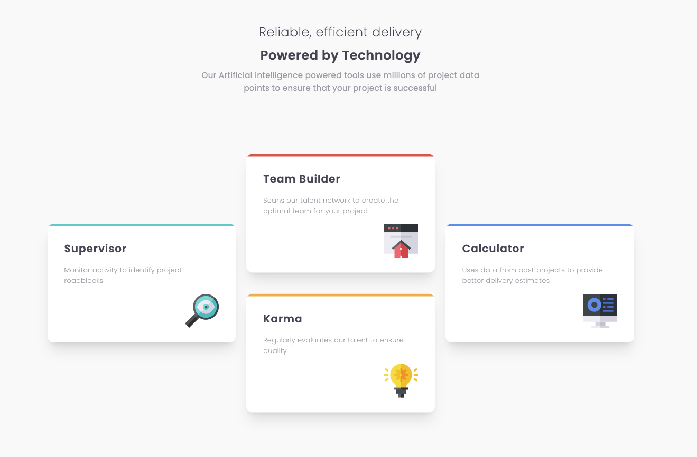
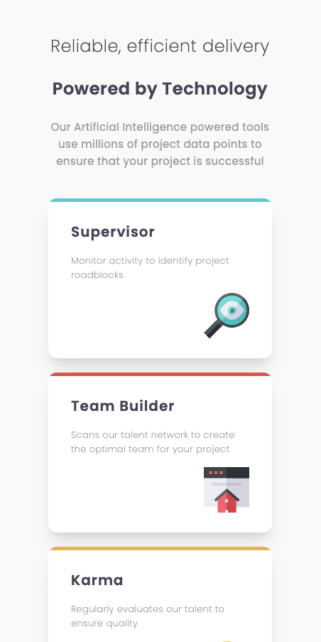

# Frontend Mentor - Four card feature section

## Table of contents

- [Frontend Mentor - Four card feature section](#frontend-mentor---four-card-feature-section)
  - [Table of contents](#table-of-contents)
  - [Overview](#overview)
    - [The challenge](#the-challenge)
    - [Screenshot](#screenshot)
    - [Links](#links)
  - [My process](#my-process)
    - [Built with](#built-with)
    - [What I learned](#what-i-learned)
  - [Author](#author)

## Overview

### The challenge

Users should be able to:

- View the landing page on optimal screens.

### Screenshot

### Links

- Solution URL: [View Github Code](https://github.com/jchapar/four_card_feature_FEM)
- Live Site URL: [Visit Site](https://jchapar.github.io/four_card_feature_FEM/)

## My process

### Built with

- HTML 5
- Tailwind CSS
- Flexbox
- Grid
- Mobile-first workflow
- Figma - For design files

### What I learned

- Continued improvement with TailwindCss.

## Author

- Frontend Mentor - [@jchapar](https://www.frontendmentor.io/profile/jchapar)
- Twitter - [@j_chapar](https://www.twitter.com/j_chapar)
- Instagram - [@\_jchapar](https://www.instagram.com/_jchapar)
